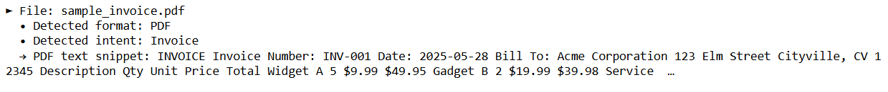
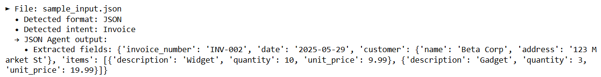

# Multi-Agent AI System

A Python‑based system that processes PDF, JSON, and email inputs. The Classifier Agent classifies format and intent, routes data to the appropriate downstream agent (JSON Agent or Email Agent), extracts and reformats fields, and logs all interactions in a shared SQLite memory store.

## Features

- **Format Classification:** PDF, JSON, or Email (plain text)
- **Intent Detection:** Invoice, RFQ, Complaint, Regulation, or General
- **JSON Agent:** Maps structured JSON to target schemas and flags anomalies
- **Email Agent:** Parses sender, subject, body, intent, and urgency for CRM use
- **Shared Memory:** SQLite database logs source, format, intent, timestamp, extracted values, and thread ID
- **Interactive Notebook:** `RAG_agent.ipynb` for step‑by‑step exploration

## Repository Structure
```text
Multi-Agent-AI/                  # Project root
├── README.md                    # Project overview and instructions
├── requirements.txt             # Python dependencies
├── sample_inputs/               # Sample files for testing
│   ├── sample_invoice.pdf       # Sample PDF invoice
│   ├── sample_input.json        # Sample JSON payload
│   └── sample_email.txt         # Sample email text
├── sample_outputs/              # Example CLI output logs
│   ├── invoice_output.png
│   ├── json_output.png
│   └── email_output.png
├── notebooks/                   # Jupyter notebooks for demos
│   └── RAG_agent.ipynb
├── main.py                      # CLI entry point
├── classifier_agent.py          # Format & intent classification
├── json_agent.py                # JSON payload processing
├── email_agent.py               # Email parsing & extraction
└── memory.py                    # SQLite memory module
```
## Tech Stack & Dependencies

- Python 3.7+
- PyMuPDF for PDF text extraction
- FPDF for generating sample PDF invoices
- SQLite (via Python’s built-in sqlite3) for lightweight shared memory
- Pandas for Notebook data display
- Jupyter Notebook for interactive demos

Dependencies are listed in `requirements.txt`. Install with:
``` bash
pip install -r requirements.txt
```

## Sample Outputs

**For PDF**


**For JSON**


**For Email**

